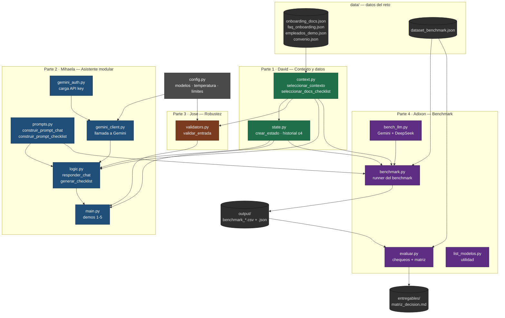
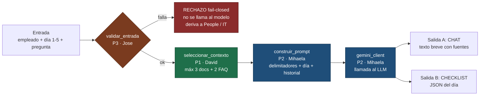

# Employee Onboarding Assistant — Bridge SA

Copiloto que acompaña a **empleados nuevos** en sus primeros días: responde dudas
con la documentación interna, genera el checklist del día y sabe cuándo derivar a
People o IT.

Team Challenge · Sprint 05–07 — Bootcamp AI Engineering (The Bridge).

---

## Instalación

```bash
# 1. Clonar el repositorio
git clone https://github.com/adxalex/employee-onboarding-assistant.git
cd employee-onboarding-assistant

# 2. Entorno virtual
python -m venv .venv
.venv\Scripts\activate        # Windows
# source .venv/bin/activate   # macOS / Linux

# 3. Dependencias
pip install -r requirements.txt

# 4. Claves de API
copy .env.example .env        # Windows  (cp en macOS/Linux)
```

Edita el `.env` con tus claves:

```env
GEMINI_API_KEY=tu_clave
GEMINI_MODELS=gemini-2.5-flash,gemini-3.5-flash

DEEPSEEK_API_KEY=tu_clave
DEEPSEEK_MODELS=deepseek-chat,deepseek-reasoner

# Qué corre el benchmark: deepseek | gemini | ambos
BENCH_MODE=gemini
```

> El `.env` está en `.gitignore` — **nunca se sube al repositorio**.
> Para ver qué modelos acepta tu cuenta: `python list_modelos.py`

---

## Cómo ejecutar

```bash
python main.py 1     # Parte 2 — chat (dev junior, día 1)
python main.py 2     # Parte 2 — checklist JSON del día
python main.py 3     # Partes 1+2 — misma pregunta: comercial vs remoto UE
python main.py 4     # transversal — día 1 vs día 3
python main.py 5     # Parte 3 — vulnerable vs seguro
python main.py       # todas las demos

python benchmark.py  # Parte 4 — corre el benchmark según BENCH_MODE
python evaluar.py    # Parte 4 — genera entregables/matriz_decision.md
```

---

## Arquitectura: integración entre módulos

Diagrama generado a partir de los `import` reales de cada módulo.



**Nota de diseño:** `benchmark.py` **no pasa por `logic.py`**. Orquesta directamente
`context` → `prompts` → `bench_llm`, porque cada caso del benchmark debe ser
independiente (`logic.py` acumula historial, pensado para chat interactivo).

---

## Recorrido de una petición en ejecución



---

## Mapa de módulos, partes y responsables

| Módulo | Parte | Responsable | Qué hace | Depende de |
|--------|-------|-------------|----------|------------|
| `config.py` | común | David | Modelos, temperatura, límites | — |
| `context.py` | 1 | David | Carga `data/` y selecciona docs/FAQ relevantes | — |
| `state.py` | 1 | David | Empleado + día + historial (≤4 turnos) | `context` |
| `prompts.py` | 2 | Mihaela | Construye los prompts con delimitadores | — |
| `gemini_auth.py` | 2 | Mihaela | Carga `GEMINI_API_KEY` desde `.env` | — |
| `gemini_client.py` | 2 | Mihaela | Llamada a Gemini | `config`, `gemini_auth` |
| `logic.py` | 2 | Mihaela | Orquesta chat y checklist | `context`, `state`, `prompts`, `gemini_client` |
| `main.py` | 2 | Mihaela | Demos 1-5 ejecutables | `logic`, `state`, `validators` |
| `validators.py` | 3 | Jose | Validación fail-closed de la entrada | `config`, `context` |
| `bench_llm.py` | 4 | Adixon | Cliente multi-proveedor (Gemini/DeepSeek) | — |
| `benchmark.py` | 4 | Adixon | Corre el dataset contra N modelos y mide | `context`, `state`, `prompts`, `bench_llm` |
| `evaluar.py` | 4 | Adixon | Chequeos automáticos + matriz de decisión | — |
| `list_modelos.py` | 4 | Adixon | Lista los modelos disponibles de la cuenta | — |

---

## Requisitos técnicos

- Python 3.10+
- Dependencias en `requirements.txt`: `google-genai`, `openai`, `python-dotenv`
- Claves en `.env` (nunca en el repositorio)
